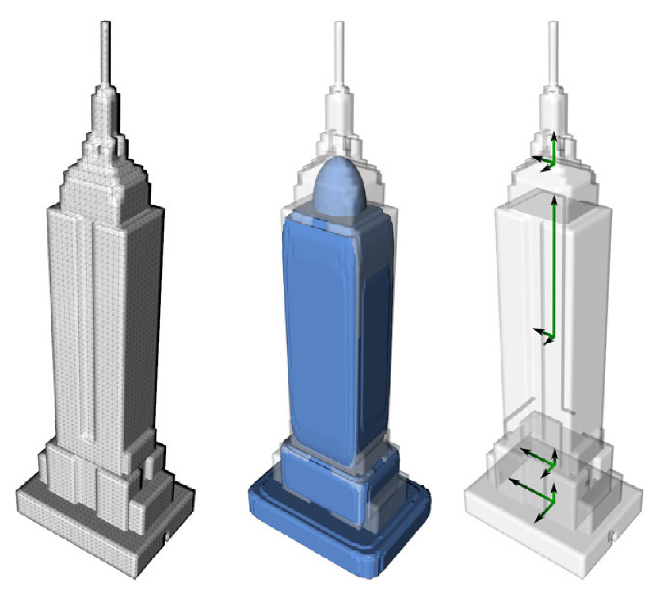

# Literature


<!-- WARNING: THIS FILE WAS AUTOGENERATED! DO NOT EDIT! -->

## Non-Realistic Object Stylization

The paper describes a method for creating stylized geometry for
pre-segmented input models. It uses an initial shape analysis step to
find the type of fill pattern and its orientation to be used. In an
interactive process the user can then choose a fill pattern for each
segment. In a clipping stage the fill pattern is then clipped against
the model boundary and all segments are assembled into a complete model.

### Shape Analysis

The shape analysis is the most interesting part here, it consists of
**Random Sample Consensus (RANSAC)**, which helps to determine the
best-fitting primitive shape such as a box-, ellipsoid- or a cone-like
structure. It uses a limited amount of vertex samples per iteration to
find a primitive shape that is most similar to the shape of the segment.

**Principal Component Analysis (PCA)** is to determine the axes of
maximum variance of the vertex coordinates and computes 3 main axes as
well as the ratio of variance between these. This allows to orient the
primitives that are fit to the model and help select an appropriate fill
pattern.

When both methods are combined good selections for fill patterns can be
made that can also be oriented and distributed optimally within the
model.

<figure>

<figcaption aria-hidden="true">pca-ransac.png</figcaption>
</figure>

Schematic diagram from the paper that shows the outcome of RANSAC and
PCA. While the input mesh is given on the left, the center illustrates
the shapes detected with RANSAC and the right-hand side points out the
main directions of PCA for each segment.

## Implementation

In this notebook I implement a demonstration of each of these methods on
an input model and then combine both of them to get similar results to
those in the paper.

### Primitive Fitting with RANSAC

To implement RANSAC for shape fitting we need to be able to load a
model.

We also need shapes to fit to the model.

``` python
# load model 

model1 = "data/2012 BMW 1M.glb"
model2 = "data/big_soviet_panel_house_lowpoly.glb"
model3 = "data/griveous bust.glb"
model4 = "data/pixui2.glb"
scene = trimesh.Scene()

shapes = []

number_of_points = 6
inlier_threshold = 0.1
number_of_trials = 10

#trimesh.util.attach_to_log()

mesh = trimesh.load(model4, force='mesh')
scene.add_geometry(mesh)
```

``` python
mesh.show()
```

``` python
type(mesh)
```

``` python
mesh.is_watertight
```

``` python
vertices = np.array(mesh.vertices)
vertices
```

------------------------------------------------------------------------

<a
href="https://github.com/flupppi/blenderproc-test-scenes/blob/main/blenderproc_test_scenes/core.py#L21"
target="_blank" style="float:right; font-size:smaller">source</a>

### ransac_bounding_box

>  ransac_bounding_box (points, n_trials=10, sample_size=6, threshold=0.01)

------------------------------------------------------------------------

<a
href="https://github.com/flupppi/blenderproc-test-scenes/blob/main/blenderproc_test_scenes/core.py#L47"
target="_blank" style="float:right; font-size:smaller">source</a>

### ransac_cylinder_with_pca

>  ransac_cylinder_with_pca (points, n_trials=1000, threshold=0.05)

------------------------------------------------------------------------

<a
href="https://github.com/flupppi/blenderproc-test-scenes/blob/main/blenderproc_test_scenes/core.py#L96"
target="_blank" style="float:right; font-size:smaller">source</a>

### trimesh_scene_with_box

>  trimesh_scene_with_box (mesh, fit_box)

------------------------------------------------------------------------

<a
href="https://github.com/flupppi/blenderproc-test-scenes/blob/main/blenderproc_test_scenes/core.py#L114"
target="_blank" style="float:right; font-size:smaller">source</a>

### trimesh_scene_with_sphere

>  trimesh_scene_with_sphere (mesh, fit_sphere)

------------------------------------------------------------------------

<a
href="https://github.com/flupppi/blenderproc-test-scenes/blob/main/blenderproc_test_scenes/core.py#L130"
target="_blank" style="float:right; font-size:smaller">source</a>

### trimesh_scene_with_cylinder

>  trimesh_scene_with_cylinder (mesh, fit_cylinder, height=None)

------------------------------------------------------------------------

<a
href="https://github.com/flupppi/blenderproc-test-scenes/blob/main/blenderproc_test_scenes/core.py#L166"
target="_blank" style="float:right; font-size:smaller">source</a>

### run_ransac_fits

>  run_ransac_fits (points, threshold=0.01, n_trials=1000)

------------------------------------------------------------------------

<a
href="https://github.com/flupppi/blenderproc-test-scenes/blob/main/blenderproc_test_scenes/core.py#L187"
target="_blank" style="float:right; font-size:smaller">source</a>

### ransac_sphere

>  ransac_sphere (points, n_trials=1000, sample_size=4, threshold=0.1)

``` python
# Run RANSAC
fits = run_ransac_fits(vertices, threshold=0.05, n_trials=500)
for name, result in fits.items():
    print(f"{name} fit: inliers={result['inliers']} ({(result['inliers']/len(mesh.vertices)*100):.4f}%, fit={result['fit']}")
```

``` python
trimesh_scene_with_box(mesh, fits['box']['fit']).show()
```

``` python
trimesh_scene_with_sphere(mesh, fits['sphere']['fit']).show()
```

``` python
trimesh_scene_with_cylinder(mesh, fits["cylinder"]["fit"]).show()
```

### Determining Orientation and Shape Dimensions using PCA

------------------------------------------------------------------------

<a
href="https://github.com/flupppi/blenderproc-test-scenes/blob/main/blenderproc_test_scenes/core.py#L217"
target="_blank" style="float:right; font-size:smaller">source</a>

### analyze_pca

>  analyze_pca (points)

``` python
# Run PCA
pca_axes, pca_variances = analyze_pca(vertices)

print("PCA Axes:\n", pca_axes)
print("PCA Variance Ratios:\n", pca_variances)
```

------------------------------------------------------------------------

<a
href="https://github.com/flupppi/blenderproc-test-scenes/blob/main/blenderproc_test_scenes/core.py#L225"
target="_blank" style="float:right; font-size:smaller">source</a>

### set_axes_equal

>  set_axes_equal (ax)

*Set 3D plot axes to equal scale.*

------------------------------------------------------------------------

<a
href="https://github.com/flupppi/blenderproc-test-scenes/blob/main/blenderproc_test_scenes/core.py#L245"
target="_blank" style="float:right; font-size:smaller">source</a>

### plot_mesh_with_pca_and_box

>  plot_mesh_with_pca_and_box (vertices, pca_axes, fit_box)

``` python
plot_mesh_with_pca_and_box(vertices, pca_axes, fits['box']['fit'])
```
